# 🚶🏻‍➡️ Lazy Traveler : 종로구 AI 스케줄링 챗봇

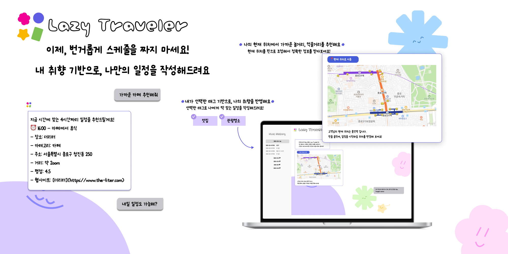

Lazy Traveler는 고객의 위치, 시간, 관심 태그를 기반으로 일정을 손쉽게 만들어 드립니다.   Django Rest Framework(DRF)를 사용하여 API를 구축하고, AI 모델과 연결하여 사용자 질의에 실시간으로 응답합니다.

---

## 👋🏻 팀원 구성

<table style="border-collapse: collapse; width: 100%; text-align: center;">
  <thead>
    <tr>
      <th style="padding: 10px;">항목</th>
      <th style="padding: 10px;">김유현(PM)</th>
      <th style="padding: 10px;">오세은(PL)</th>
      <th style="padding: 10px;">김민채</th>
      <th style="padding: 10px;">백명남</th>
      <th style="padding: 10px;">이영주</th>
    </tr>
  </thead>
  <tbody>
    <tr>
      <th style="padding: 10px;">GitHub</th>
      <td style="padding: 10px;">
        <a href="https://github.com/youhyun-kim">@Elliee</a>
      </td>
      <td style="padding: 10px;">
        <a href="https://github.com/ohsen12">@ohsen</a>
      </td>
      <td style="padding: 10px;">
        <a href="https://github.com/MINCHAEKEEM">@김코린</a>
      </td>
      <td style="padding: 10px;">
        <a href="https://github.com/MarvinBaek">@Marvin Baek</a>
      </td>
      <td style="padding: 10px;">
        <a href="https://github.com/young1116">@young1116</a>
      </td>
    </tr>
    <tr>
      <th style="padding: 10px;">블로그</th>
      <td style="padding: 10px;">
        <a href="https://elliee-thinkerpad.tistory.com/">https://elliee-thinkerpad.tistory.com/</a>
      </td>
      <td style="padding: 10px;">
        <a href="https://tpsdms12.tistory.com/">https://tpsdms12.tistory.com/</a>
      </td>
      <td style="padding: 10px;">
        <a href="https://etonlit.tistory.com/">https://etonlit.tistory.com/</a>
      </td>
      <td style="padding: 10px;">
        <a href="https://qoraudska.tistory.com/">https://qoraudska.tistory.com/</a>
      </td>
      <td style="padding: 10px;">
        <a href="https://young95.tistory.com/">https://young95.tistory.com/</a>
      </td>
    </tr>
    <tr>
      <th style="padding: 10px;">이메일</th>
      <td style="padding: 10px;">
        yuurikim12@gmail.com
      </td>
      <td style="padding: 10px;">
        tpsdms121@gmail.com
      </td>
      <td style="padding: 10px;">
        추후 추가 예정
      </td>
      <td style="padding: 10px;">
        qoraudska97@gmail.com
      </td>
      <td style="padding: 10px;">
        youngjoo6452@gmail.com
      </td>
    </tr>
    <tr>
      <th style="padding: 10px;">역할</th>
      <td style="padding: 10px;">프로덕트 기획 및 총괄</td>
      <td style="padding: 10px;">BE, FE, Vercel 배포</td>
      <td style="padding: 10px;">BE</td>
      <td style="padding: 10px;">BE, FE</td>
      <td style="padding: 10px;">BE, AWS 배포</td>
    </tr>
  </tbody>
</table>

####  - 개발 기간 : 2025년 2월 27일 ~ 2025년 3월 31일

#### - 서비스 접속 : [https://www.lazy-traveler.store](https://www.lazy-traveler.store)

---

## 목차
- [1. 프로젝트 개요](#1-프로젝트-개요)
- [2. 서비스 아키텍처](#2-서비스-아키텍처)
- [3. 주요 기능](#3-주요-기능)

---

## 1. 프로젝트 개요
### 🔹 프로젝트 주제 선정 배경
1. 검색 채널이 **다양**해지면서 정보, 허위정보 과다로 **나에게 딱 맞는 정보를 찾기 어려움** 
2. 목적에 따라 다양한 검색 채널을 이용하는 추이, **여러 검색 결과를 하나의 결과 데이터로 가공**해야 하는 번거로움 존재

### 🔹 프로젝트 구체화 과정
- 💁🏻‍♀️ “하나의 채널에서, 내 취향과 위치가 반영된 정확한 정보를 제공해줄 순 없을까?”

> "하나의 채널" → **챗봇**
> "내 취향 기반" → **관심 태그를 설정**하여 카테고리를 필터링
> "정확한 정보" → 구글 Places API를 활용하여 **RAG 기반으로 실시간 정보를 제공**하자
> "내 위치 기반" → 브라우저에서 위치 동의를 받아, **일정을 시작할 위치**를 제공받자

- 💁🏻‍♀️ "프로덕트를 서울 전체로 하기에는 범위가 너무 넓다! **밥도 먹고 볼거리도 있는 장소, 어디에서 시작하면 좋을까?"**

> "유동인구 많은 지역" → TOP3 강남, 명동, **종로**
> "먹을거리 뿐만 아니라 볼거리도 많은 지역" → 명동, **종로**
> "국내 서비스이므로, 국내 유동인구가 더 많은 지역" → **종로**

→ MVP에 작합한 지역으로 **종로** 선택

## 🔹 프로젝트 목표

1. **맞춤형 서비스로,** 일정 서치에 소요되는 **유저의 시간과 비용을 절감 시켜주자**
    
2. **RAG** 기술을 적용하여 LLM만으로는 부족한 정보를 보완하자
3. 여러 검색 결과를 하나의 채널에서 보여주기 적합한 **대화형 인터페이스를 사용**하자
4. 방문객이 더 오래 머무를 수 있도록 흥미로운 **장소 추천**을 제공하자

👋🏻 **Lazy Traveler는 AI와 RAG 기술을 활용하여 보다 스마트한 종로 여행 경험을 제공합니다.**

---

## 2. 서비스 아키텍처

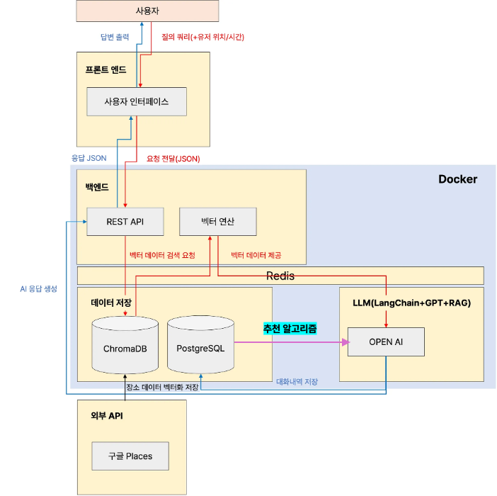

### 🛠️ 기술 스택

  <table width="100%" style="border-collapse: collapse;">
    <tr style="background-color:#f2f2f2;">
      <th style="text-align:center; padding: 10px;"><b>카테고리</b></th>
      <th style="text-align:center; padding: 10px;"><b>기술 및 설명</b></th>
    </tr>
    <tr>
      <td align="center" style="padding: 10px;"><b>Frontend</b></td>
      <td align="left" style="padding: 10px;">
        - <b>HTML, CSS, JavaScript</b> : UI 구성 요소, 사용자와의 인터랙션 등을 세밀하게 조정하여 커스터마이징
      </td>
    </tr>
    <tr>
      <td align="center" style="padding: 10px;"><b>Backend</b></td>
      <td align="left" style="padding: 10px;">
        - <b>Python3.10</b> : 다양한 라이브러리 및 프레임워크와의 호환성이 뛰어난 버전  
        - <b>Django4.2</b> : 장기 지원 버전(LTS, Long-Term Support)  
        - <b>Django REST Framework (DRF)</b> : Django 기반의 RESTful API 개발을 위한 프레임워크  
        - <b>Redis</b> : 웹소켓 서버 간 메시지 브로커 
        - <b>WebSocket</b> : 클라이언트와 서버 간 지속적 연결을 유지하며 실시간 통신 
        - <b>Postman</b> : API 테스트 및 디버깅  
      </td>
    </tr>
    <tr>
      <td align="center" style="padding: 10px;"><b>Database</b></td>
      <td align="left" style="padding: 10px;">
        - <b>PostgreSQL</b> : 관계형 데이터베이스 관리 시스템 (RDBMS)  
        - <b>Chroma</b> : 비정형 데이터를 벡터화하여 유사도 기반 빠르고 정확한 검색
      </td>
    </tr>
    <tr>
      <td align="center" style="padding: 10px;"><b>AI Services</b></td>
      <td align="left" style="padding: 10px;">
        - <b>OpenAI</b> : 임베딩 및 대화형 응답 생성 
        - <b>LangGraph</b> : 그래프 기반 워크플로우 구성 
        - <b>text-embedding-3-small</b> : 빠른 응답 시간과 적은 리소스를 사용하면서도 좋은 성능을 제공 
        - <b>ChatGPT-4o-mini</b> : 크기가 작고 최적화되어 있어 빠른 응답 시간을 제공하면서도 좋은 성능을 유지 
      </td>
    </tr>
    <tr>
      <td align="center" style="padding: 10px;"><b>Deploy</b></td>
      <td align="left" style="padding: 10px;">
        - <b>Docker</b> : 일관된 개발 및 운영 환경을 유지 
        - <b>Docker Compose</b> : 여러 컨테이너를 하나의 애플리케이션으로 구성하여 관리하고, 간편한 배포 및 확장 지원 
        - <b>Amazon EC2</b> : 클라우드에서의 서버 구축과 운영을 지원하는 AWS의 가상 서버 
        - <b>Route 53</b> : AWS의 DNS 서비스  
        - <b>Nginx</b> : 리버스 프록시 및 웹 서버  
        - <b>Gunicorn</b> :  Python 기반 웹 애플리케이션을 실행하기 위한 WSGI 서버 
        - <b>Vercel</b> : 간편한 프론트엔드 배포 
      </td>
    </tr>
    <tr>
      <td align="center" style="padding: 10px;"><b>Collaboration</b></td>
      <td align="left" style="padding: 10px;">
        - <b>Slack</b>: 팀 커뮤니케이션 및 정보 공유  
        - <b>Figma</b> : UI/UX 디자인 및 프로토타이핑 
        - <b>Confluence</b> : 문서화 및 협업 관리 
        - <b>Jira</b> : TC 기반 QA 진행 
        - <b>GitHub</b> : 코드 버전 관리 및 협업  
      </td>
    </tr>
  </table>

---

## 3. 주요 기능

> - 질의 시간, 현재 위치, 관심 태그 기반의 **개인화된 맞춤 방문 코스 제안**
> - 로그인 유저에 한하여, 이전 스케줄링 정보 조회 가능

### 3-1. 기능 상세

#### 🔹 공통

1. 코치마크  
    - 서비스 최초 진입 시 노출, **코치마크가 닫히고, `localStorage`에 닫힌 상태가 저장됨**  
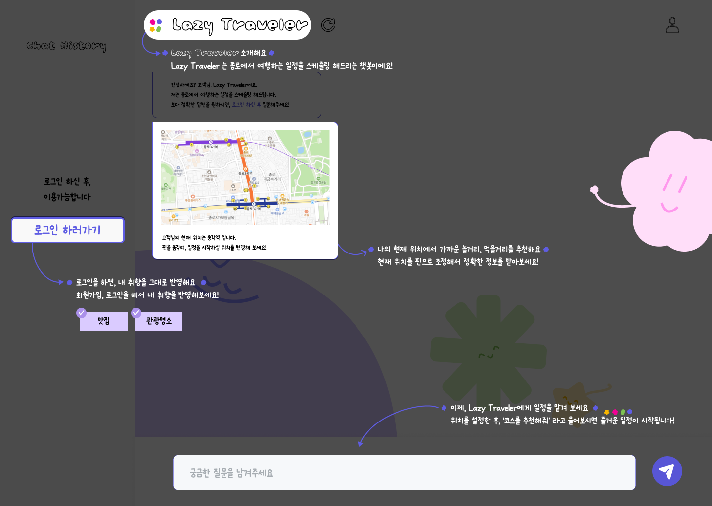

#### 🔹 회원가입/로그인

1. 회원가입 (→모든 조건 충족 시, 회원가입 진행)
   - **유저 ID**  
     1. 중복 확인
   - **비밀번호 입력**
        1. 비밀번호 재확인 → 비밀번호 재확인 시, 이전 비밀 번호 일치여부 확인
   - **관심 태그 설정**
        1. 최소 1개 이상의 태그 설정해야 함, 모든 태그 선택 가능
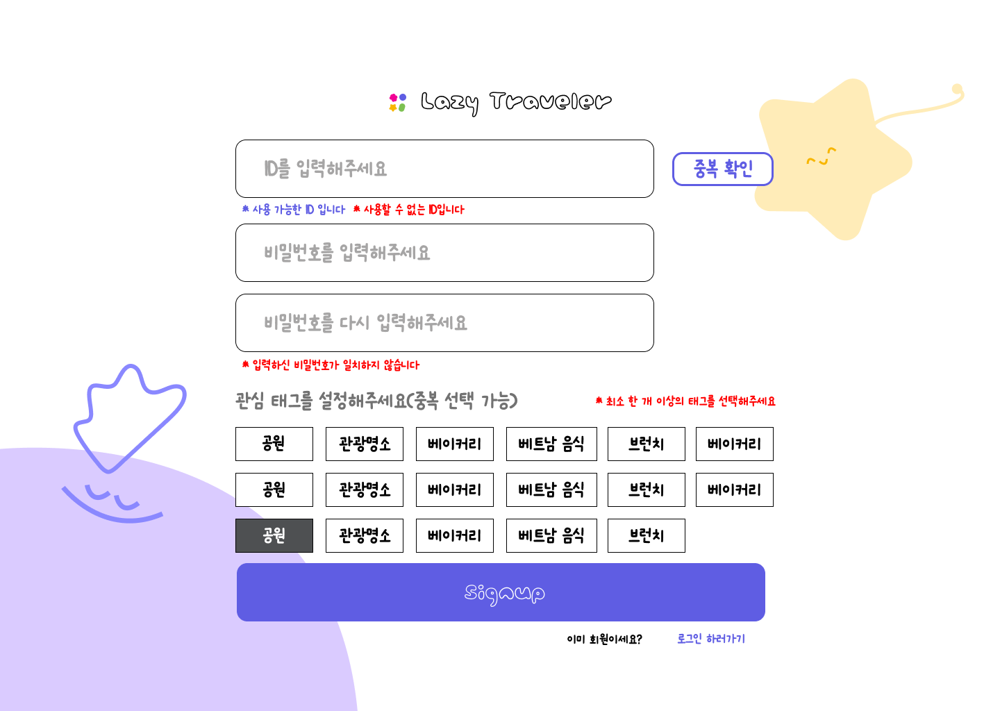

1. **로그인**
   - 로그인 ID
   - 비밀번호
      1. 로그인 ID, 비밀번호가 일치하지 않거나, 가입되지 않은 유저의 경우 ‘ID 혹은 비밀번호가 일치하지 않습니다’ 검증 문구 출력
         - ID, 비밀번호를 특정해서 전달하지 않는 이유 : 보안 이슈
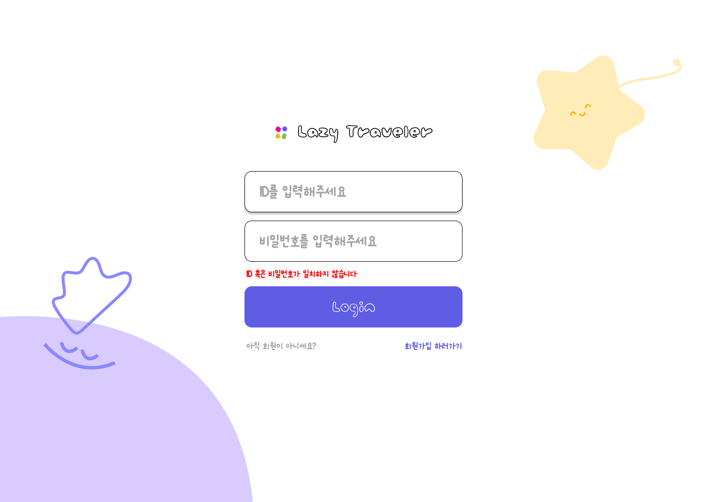

#### 🔹 챗봇 답변

1. **챗봇 답변 범위**
   - 대화
   - 서비스 기능 대화
   - 종로구 스케줄링 추천(유저 관심사, 위치, 질의 시간 기반) 

2. RAG 구축 방법
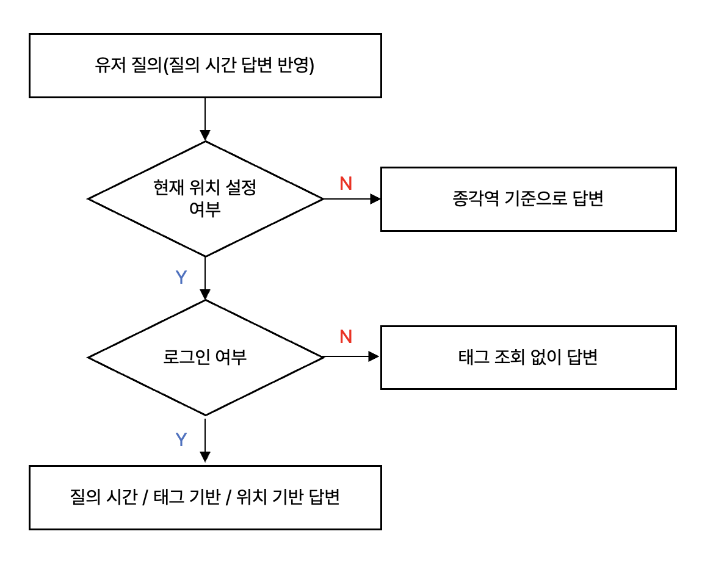

    2.1 RAG 구축 과정
     1. 태그별로 Google Places API 에 미리 검색 후 임베딩하여 벡터 DB에 구축해놓기
     2. 태그 종류는 검색 데이터를 기반으로 그룹핑(데이터 품질 관리)
     3. 사용자의 위치와 현재시간을 기반으로 하기에 영업시간이 나오지 않는 장소 제거
     4. 리뷰 개수가 30개 미만인 장소 제거

    2.2  이후 LLM 답변 벡터 DB에서 참고하여 생성
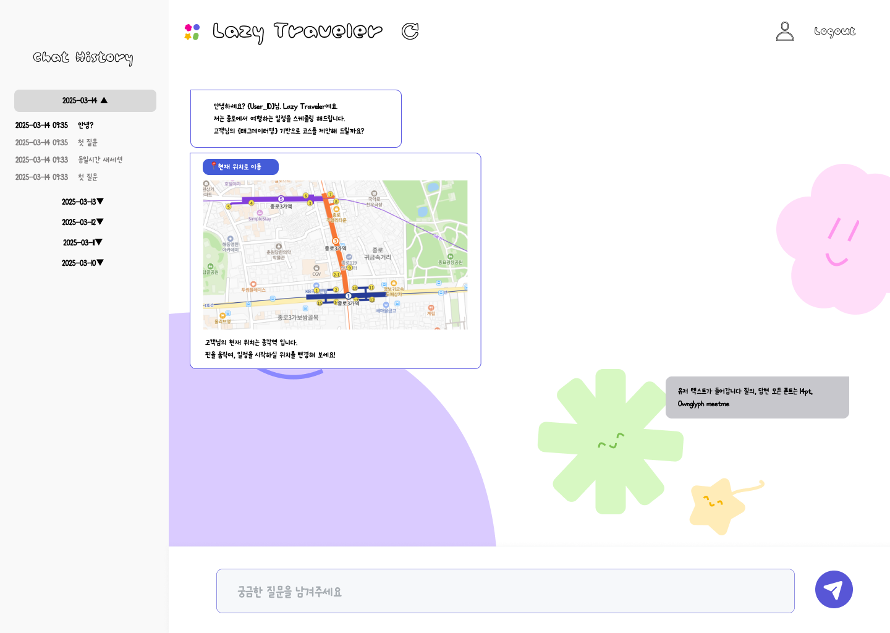

#### 🔹 마이페이지

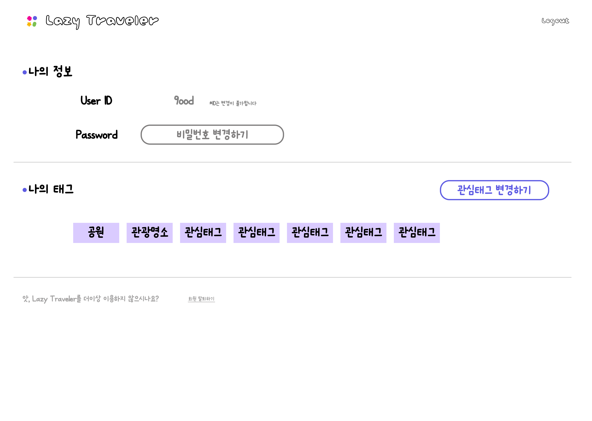

1. 나의 정보
    - User_ID : 유저 아이디는 수정 불가
    - 비밀번호 변경 
        1. 현재 비밀번호 입력 → 현재 비밀번호가 일치하지 않는 경우, 벨리데이션 문구 노출
        2. 새로운 비밀번호 → 현재 비밀번호와 새로운 비밀번호가 일치하는 경우, 벨리데이션 문구 노출
        3. 새로운 비밀번호 확인 → 새롭게 입력한 비밀번호와, 재확인 비밀번호가 일치하지 않을 때 벨리데이션 문구 노출

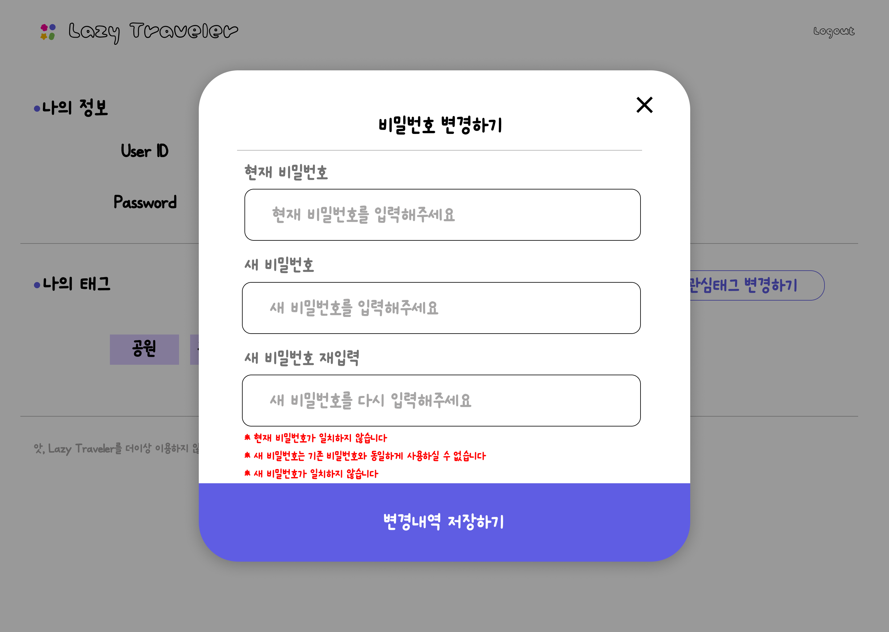

2. 내가 선택한 태그
    - 내가 선택한 태그 정보
    - 태그 수정하기 
        1. 태그 수정하기 클릭 시, 현재 선택한 태그와 추가할 태그 리스트 노출
        2. 한 개 이상의 태그가 지정되지 않은 경우, 태그 수정 불가
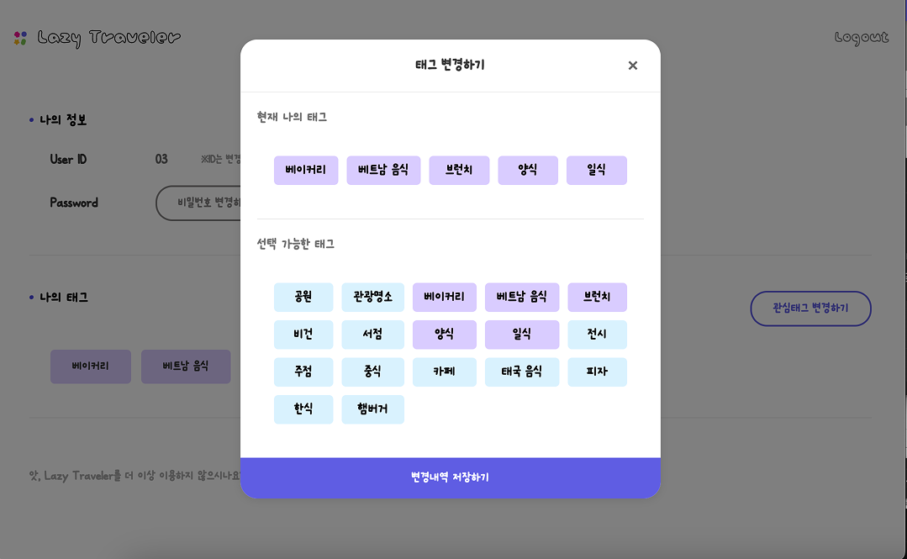

3. 회원 탈퇴
    - 회원 탈퇴 시 관련된 모든 정보 파기
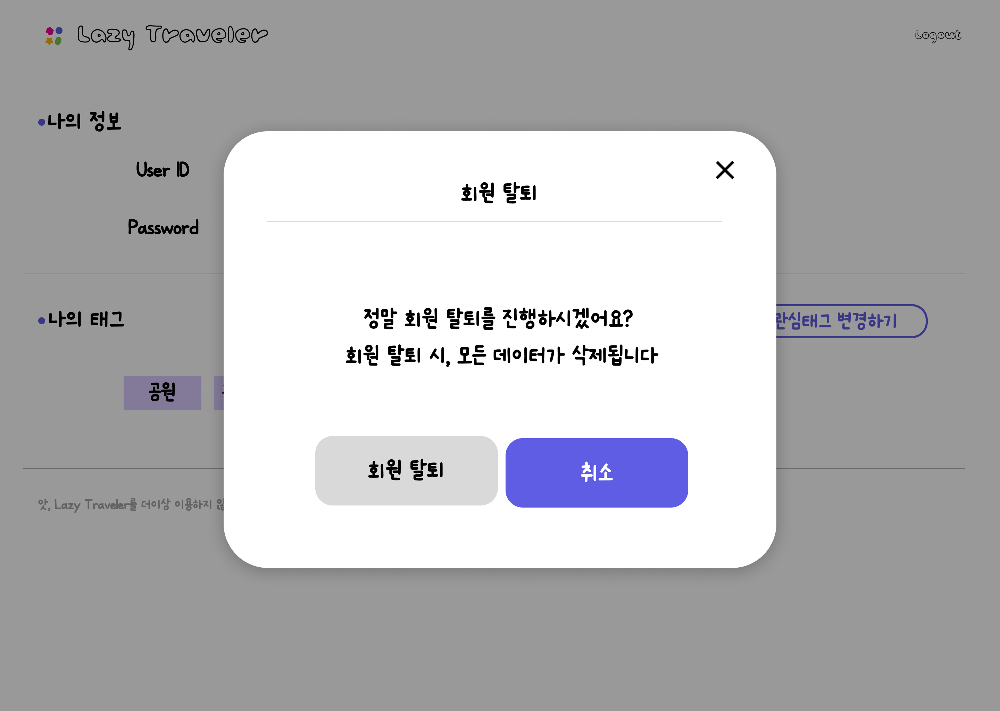

---

## 라이센스

이 프로젝트는 MIT 라이선스를 따릅니다.